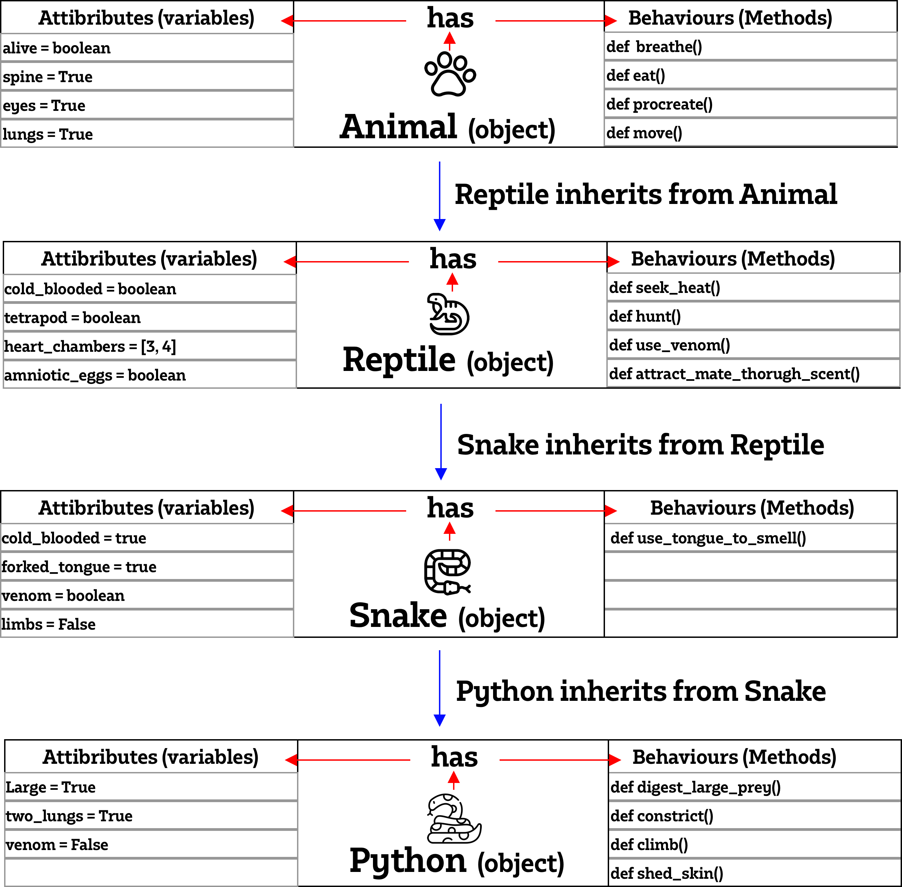

# Object-Oriented Python
-  **Object-oriented programming (OOP)** refers to a programming methodology based on objects, instead of just functions and procedures. These objects are organized into classes, which allow individual objects to be grouped together.
## Why OOP? 
- Re-usability
- Data Redundancy
- Code Maintenance
- Security
- Easy troubleshooting

## Four pillars of OOP:
- **Abstraction**: is the process of showing only essential/necessary features of an entity/object to the outside world and hide the other irrelevant information.  
- **Encapsulation**: Makes data private from user. Providing security to data by making the variable as private and expose the property to access the private data which would be public.  
- **Inheritance**: The ability of creating a new class from an existing class. Inherit attributes(variables) and methods(behaviours) from a parent class.  
- **Polymorphism**: Inherit from a parent class as well as override the data. A subclass can define its own unique behavior and still share the same functionalities or behavior of its parent/base class.   

### Example of OOP:

